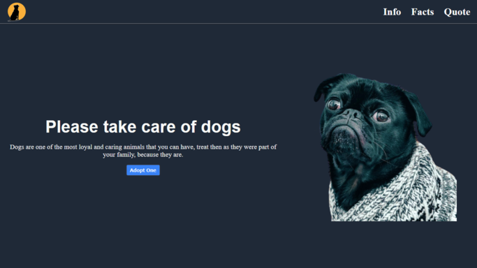
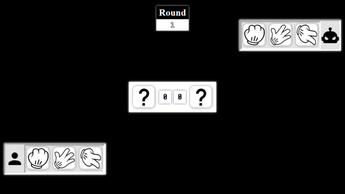

# The Odin Project projects
All projects from fullstack javascript curriculum 

## Landing Page - [Website](https://landing-page-86c.pages.dev/) - [Repository](https://github.com/LukBlan/the-odin-project/tree/landing-page?tab=readme-ov-file)
Landing page about dogs with navbar navigation  
Technologies: Html - Css - Typescript

## Rock Paper and Scissors - [Website](https://rock-paper-scissors-bwm.pages.dev/) - [Repository](https://github.com/LukBlan/the-odin-project/tree/rock-paper-scissors?tab=readme-ov-file)
Web game with a cool game over screen  
Technologies: Html - Css - Typescript  

## Etch a Sketch

## Calculator

## Sign Up Form

## Admin Dashboard

## Library

## Tic Tac Toe

## Restaurant Page

## Todo List

## Weather App

## Battleship

## Homepage

## Cv Application

## Memory Card

## Shopping Cart
